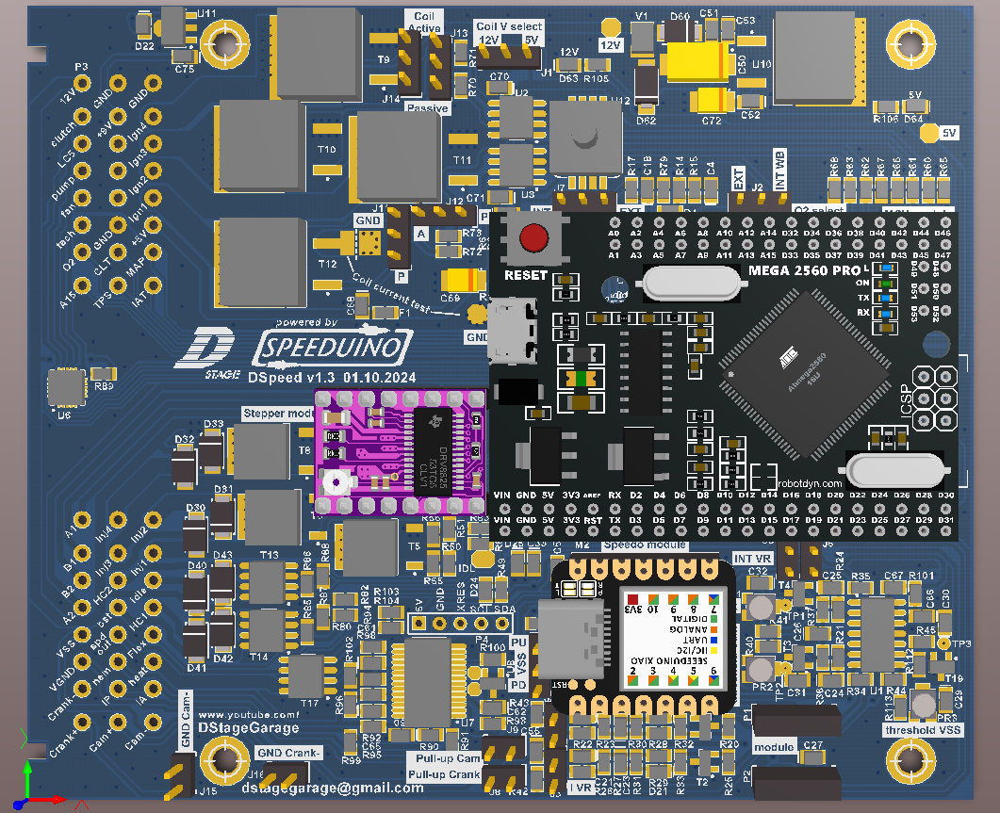

# DSpeed
Speeduino incarnation based on ATMega2560 with some extra features.

## Main connectors

| L | E | F | T |   |   |   |   |   |   |   |   | R | I | G | H | T |
| :---: | :---: | :---: | :---: | :---: | :---: | :---: | :---: | :---: | :---: | :---: | :---: | :---: | :---: | :---: | :---: | :---: |
| B8C | B7C | B6C | B5C | B4C | B3C | B2C | B1C |   | A8C | A7C | A6C | A5C | A4C | A3C | A2C | A1C |
| B8B | B7B | B6B | B5B | B4B | B3B | B2B | B1B |   | A8B | A7B | A6B | A5B | A4B | A3B | A2B | A1B |
| B8A | B7A | B6A | B5A | B4A | B3A | B2A | B1A |   | A8A | A7A | A6A | A5A | A4A | A3A | A2A | A1A |

**Left connector (B)**

| Pin | Signal | Function |
| :---: | :---: | :--- |
| B8C | PGND | Power ground |
| B7C | COIL4 | Ignition coil 4 output |
| B6C | COIL3 | Ignition coil 3 output |
| B5C | COIL2 | Ignition coil 2 output |
| B4C | COIL1 | Ignition coil 1 output |
| B3C | +5V | 5V power output for sensors |
| B2C | MAP | External MAP sensor input |
| B1C | IAT | Inteke air temperature sensor input |
| B8B | PGND | Power ground |
| B7B | +9V | 9V power output for 2-wire ABS sensor |
| B6B | - | Reserved |
| B5B | - | Reserved |
| B4B | - | Reserved |
| B3B | AGND | Analogue ground for sensors |
| B2B | CLT | Coolant temperature sensor input |
| B1B | TPS | Throttle position sensor input |
| B8A | 12V | 12V power input |
| B7A | Clutch | Clutch sensor input |
| B6A | LC5 | Universal low current output |
| B5A | PUMP | Fuel pump relay control output |
| B4A | FAN | Fan relay control output |
| B3A | TACHO | Tachometer signal output |
| B2A | O2 | External oxygen sensor input |
| B1A | A15 | Universal analogue input |

**Right connector (A)**

| Pin | Signal | Function |
| :---: | :---: | :--- |
| A8C | INJ2 | Injector 2 output |
| A7C | INJ1 | Injector 1 output |
| A6C | IDLE | Idle PWM signal output |
| A5C | HC1 | Universal high current output 1 |
| A4C | FLEX | Flex fuel sensor input |
| A3C | WB_HT | Wideband oxugen sensor heater control output |
| A2C | WB_IA |  Wideband oxugen sensor IA signal |
| A1C | CAM- | Camshaft position sensor negative input |
| A8B | INJ4 | Injector 4 output |
| A7B | INJ3 | Injector 3 output |
| A6B | HC2 | Universal high current output 2 |
| A5B | BOOST | Boost controler PWM signal output |
| A4B | SPDO | Speedometer signal output |
| A3B | WB_NE | Wideband oxugen sensor Nermest signal |
| A2B | WB_IP | Wideband Oxugen sensor IP signal |
| A1B | CAM+ | Camshaft position sensor positive input |
| A8A | ST_A1 | Stepper motor output A1 |
| A7A | ST_B1 | Stepper motor output B1 |
| A6A | ST_B2 | Stepper motor output B2 |
| A5A | ST_A2 | Stepper motor output A2 |
| A4A | VSS | Vehicle speed sensor input |
| A3A | WB_VG | Wideband oxugen sensor virtual ground |
| A2A | CRANK- | Crankshaft position sensor negative input |
| A1A | CRANK+ | Crankshaft position sensor positive input |

## Configuration jumpers

| ID | Function | Description |
| :---: | :---: | --- |
| J1 | Ignition | Jumping 1-2 sets the cooil drivers voltage to 5V. Jumping 2-3 sets the cooil drivers voltage to 12V. For use with built-in ignition transistors (passive coils set witj J11-14) use of 12V may result in less heat dissipated in transistors although it may be case dependant and both settings will work. For active coils (set with J11-14) user has to know which input voltage is correct for them. |
| J2 | O2    | Jumping 1-2 feeds the Speeduino with the external O2 Sensor input signal. Jumping 2-3 feeds the Speeduino with the signal from the built-in wide band oxygen sensor controler. |
| J3 | Crank | Must be ON together with J6 when internal conditioner for Crank position sensor is used. Must be OFF together with J6 when external conditioner is used. |
| J4 | Cam   | Must be ON together with J5 when internal conditioner for Cam position sensor is used. Must be OFF together with J5 when external conditioner is used. |
| J5 | Cam   | Must be ON together with J4 when internal conditioner for Cam position sensor is used. Must be OFF together with J4 when external conditioner is used. | 
| J6 | Crank | Must be ON together with J3 when internal conditioner for Crank position sensor is used. Must be OFF together with J3 when external conditioner is used. |
| J7 | MAP   | Jumping 1-2 connects the built-in MAP sensor to Speeduino A5 input while external source remains connected to A3 input. This allows for using one for atmospheric compensation. Jumping 2-3 sets the use of built-in MAP sensor only by conecting it to Speeduino A3 input. External sensor signal input should remain unconnected in this case!    |
| J8 | Crank | When ON a 10k pull-up resistor to 5V is added on Crank position sensor input. |
| J9 | Cam   | When ON a 10k pull-up resistor to 5V is added on Cam position sensor input. |
| J10 | VSS  | Jumping 2-3 adds a 10k pull-up resistor to 5V on Vehicle Speed Sensor input. USed for sensors with an open collector output pulling signal to ground only such us some Hall sensors. Jumping 1-2 adds a 270R pull-down on Vehicle Speed Sensor input. Used for 2-wire Hall sensors where signal is mixed with power as found in some ABS systems. For VR sensors leave jumper open. |
| J11 | Ignition | For COIL1 output. Jumping 1-2 sets the "passive coil" option meaning the output is controled with a built-in transistor. Jumping 2-3 sets the "active coil" option meaning a 5/12V (see J1 setting) logic signal at the output. |
| J12 | Ignition | For COIL2 output. Jumping 1-2 sets the "passive coil" option meaning the output is controled with a built-in transistor. Jumping 2-3 sets the "active coil" option meaning a 5/12V (see J1 setting) logic signal at the output. |
| J13 | Ignition | For COIL3 output. Jumping 1-2 sets the "passive coil" option meaning the output is controled with a built-in transistor. Jumping 2-3 sets the "active coil" option meaning a 5/12V (see J1 setting) logic signal at the output. |
| J14 | Ignition | For COIL4 output. Jumping 1-2 sets the "passive coil" option meaning the output is controled with a built-in transistor. Jumping 2-3 sets the "active coil" option meaning a 5/12V (see J1 setting) logic signal at the output. |
| J15 | Crank  | When ON the Crank- input is internally shortenned to ground. Should be ON when using VR sensor with internal conditioner and it is not grounded elswhere. |
| J16 | Cam    | When ON the Cam- input is internally shortenned to ground. Should be ON when using VR sensor with internal conditioner and it is not grounded elswhere. |

