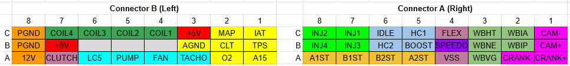
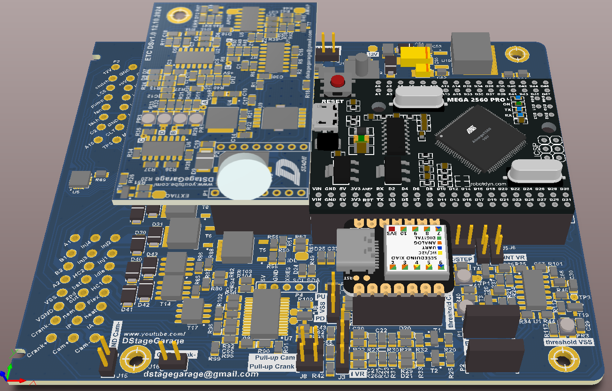

# DSpeed
Speeduino ATMega2560 incarnation optimised for automated SMD assembly of most of the components. The MCU connections are based on Speedu v0.4.4d but there are differences in analogue and digital design and some extra features were added. 

## Main connectors

> [!CAUTION]
> There should be an adequate fuse used on the main 12V power line for DSpeed. By default it should not exceed 2A and in case ETC module is used shouldn't be larger than 5A.

**Left connector (B)**

| Pin | Signal | Function |
| :---: | :---: | :--- |
| B8C | PGND | Power ground |
| B7C | COIL4 | Ignition coil 4 output |
| B6C | COIL3 | Ignition coil 3 output |
| B5C | COIL2 | Ignition coil 2 output |
| B4C | COIL1 | Ignition coil 1 output |
| B3C | +5V | 5V power output for sensors |
| B2C | MAP | External MAP sensor input |
| B1C | IAT | Inteke air temperature sensor input |
| B8B | PGND | Power ground |
| B7B | +9V | 9V power output for 2-wire ABS sensor |
| B6B | - | Reserved |
| B5B | - | Reserved |
| B4B | - | Reserved |
| B3B | AGND | Analogue ground for sensors |
| B2B | CLT | Coolant temperature sensor input |
| B1B | TPS | Throttle position sensor input |
| B8A | 12V | 12V power input |
| B7A | Clutch | Clutch sensor input |
| B6A | LC5 | Universal low current output |
| B5A | PUMP | Fuel pump relay control output |
| B4A | FAN | Fan relay control output |
| B3A | TACHO | Tachometer signal output |
| B2A | O2 | External oxygen sensor input |
| B1A | A15 | Universal analogue input |

**Right connector (A)**

| Pin | Signal | Function |
| :---: | :---: | :--- |
| A8C | INJ2 | Injector 2 output |
| A7C | INJ1 | Injector 1 output |
| A6C | IDLE | Idle PWM signal output |
| A5C | HC1 | Universal high current output 1 |
| A4C | FLEX | Flex fuel sensor input |
| A3C | WB_HT | Wideband oxugen sensor heater control output |
| A2C | WB_IA |  Wideband oxugen sensor IA signal |
| A1C | CAM- | Camshaft position sensor negative input |
| A8B | INJ4 | Injector 4 output |
| A7B | INJ3 | Injector 3 output |
| A6B | HC2 | Universal high current output 2 |
| A5B | BOOST | Boost controler PWM signal output |
| A4B | SPDO | Speedometer signal output |
| A3B | WB_NE | Wideband oxugen sensor Nermest signal |
| A2B | WB_IP | Wideband Oxugen sensor IP signal |
| A1B | CAM+ | Camshaft position sensor positive input |
| A8A | ST_A1 | Stepper motor output A1 |
| A7A | ST_B1 | Stepper motor output B1 |
| A6A | ST_B2 | Stepper motor output B2 |
| A5A | ST_A2 | Stepper motor output A2 |
| A4A | VSS | Vehicle speed sensor input |
| A3A | WB_VG | Wideband oxugen sensor virtual ground |
| A2A | CRANK- | Crankshaft position sensor negative input |
| A1A | CRANK+ | Crankshaft position sensor positive input |

## Configuration jumpers & potentiometers

| ID | Function | Description |
| :---: | :---: | :--- |
| J1 | Ignition | Jumping 1-2 sets the cooil drivers voltage to 5V. Jumping 2-3 sets the cooil drivers voltage to 12V. For use with built-in ignition transistors (passive coils set witj J11-14) use of 12V may result in less heat dissipated in transistors although it may be case dependant and both settings will work. For active coils (set with J11-14) user has to know which input voltage is correct for them. |
| J2 | O2    | Jumping 1-2 feeds the Speeduino with the external O2 Sensor input signal. Jumping 2-3 feeds the Speeduino with the signal from the built-in wide band oxygen sensor controler. |
| J3 | Crank | Must be ON together with J6 when internal conditioner for Crank position sensor is used. Must be OFF together with J6 when external conditioner is used. |
| J4 | Cam   | Must be ON together with J5 when internal conditioner for Cam position sensor is used. Must be OFF together with J5 when external conditioner is used. |
| J5 | Cam   | Must be ON together with J4 when internal conditioner for Cam position sensor is used. Must be OFF together with J4 when external conditioner is used. | 
| J6 | Crank | Must be ON together with J3 when internal conditioner for Crank position sensor is used. Must be OFF together with J3 when external conditioner is used. |
| J7 | MAP   | Jumping 1-2 connects the built-in MAP sensor to Speeduino A5 input while external source remains connected to A3 input. This allows for using one for atmospheric compensation (I think? Taken from Speeduino v0.4.4d). Jumping 2-3 sets the use of built-in MAP sensor only by conecting it to Speeduino A3 input. External sensor signal input should remain unconnected in this case!    |
| J8 | Crank | When ON a 10k pull-up resistor to 5V is added on Crank position sensor input. |
| J9 | Cam   | When ON a 10k pull-up resistor to 5V is added on Cam position sensor input. |
| J10 | VSS  | Jumping 2-3 adds a 10k pull-up resistor to 5V on Vehicle Speed Sensor input. USed for sensors with an open collector output pulling signal to ground only such us some Hall sensors. Jumping 1-2 adds a 270R pull-down on Vehicle Speed Sensor input. Used for 2-wire Hall sensors where signal is mixed with power as found in some ABS systems. For VR sensors leave jumper open. |
| J11 | Ignition | For COIL1 output. Jumping 1-2 sets the "passive coil" option meaning the output is controled with a built-in transistor. Jumping 2-3 sets the "active coil" option meaning a 5/12V (see J1 setting) logic signal at the output. |
| J12 | Ignition | For COIL2 output. Jumping 1-2 sets the "passive coil" option meaning the output is controled with a built-in transistor. Jumping 2-3 sets the "active coil" option meaning a 5/12V (see J1 setting) logic signal at the output. |
| J13 | Ignition | For COIL3 output. Jumping 1-2 sets the "passive coil" option meaning the output is controled with a built-in transistor. Jumping 2-3 sets the "active coil" option meaning a 5/12V (see J1 setting) logic signal at the output. |
| J14 | Ignition | For COIL4 output. Jumping 1-2 sets the "passive coil" option meaning the output is controled with a built-in transistor. Jumping 2-3 sets the "active coil" option meaning a 5/12V (see J1 setting) logic signal at the output. |
| J15 | Crank  | When ON the Crank- input is internally shortenned to ground. Should be ON when using VR sensor with internal conditioner and it is not grounded elswhere. |
| J16 | Cam    | When ON the Cam- input is internally shortenned to ground. Should be ON when using VR sensor with internal conditioner and it is not grounded elswhere. |
| J17 | Idle  | Jumping 1-2 choses normal signal for stepper motor driver. Jumping 2-3 will change STEP signal to IDLE signal from the MCU. This option is to be used with a DStage ETC module (DBW). |
| PR1 | Crank  | Potentiometr for setting the threshold voltage for Crank position sensor using built-in conditioner. For VR sensor typically set to 0V (measured at test point TP1), for Hall sensor typically set to 2.5V. |
| PR2 | Cam  | Potentiometr for setting the threshold voltage for Cam position sensor using built-in conditioner. For VR sensor typically set to 0V (measured at test point TP2), for Hall sensor typically set to 2.5V. |
| PR3 | VVS  | Potentiometr for setting the threshold voltage for vehicle speed sensor. For VR sensor typically set to 0V (measured at test point TP3), for Hall sensor typically set to 2.5V. |

## Internal connectors / modules

| ID | Function | Description |
| :---: | :---: | :--- |
| P1 | Crank/Cam | External VR conditioner socket (together with P2). |
| P2 | Crank/Cam | External VR conditioner socket (together with P1). |
| P4 | WB | Programming connector for wideband oxygen sensor controler. |
| M1 | MCU | Main MCU module - Arduino ATMega2560 Pro. |
| M2 | Speedo | Module for speedometer control - Arduino Xiao. |
| M3 | Step | Stepper motor driver module for idle control - DRV8825 or equivalent. |
| BT | BT | Bluetooth communication module - HC-06. |

## ETC module (DBW)
Since it's unlikely that the vehicle will need Eleectronic Throttle (DBW) and idle stepper motor driver at the same time there is an option in DSeed PCB to use the stepper driver slot for special deditacet variant of DStage ETC. You will find the production files and other documents on [ETC repo](https://github.com/DStageGarage/ElectronicThrottleController/tree/main/ETC%20v2/v2.2).

This is the mapping of main connector pins normally used for stepper motor driver for the ETC purposes:
| Pin | Sig step | Sig ETC | Function |
| :---: | :---: | :---: | :--- |
| A8A | ST_A1 | MOT1 | Throttle motor connection 1 |
| A7A | ST_B1 | MOT2 | Throttle motor connection 2 |
| A6A | ST_B2 | TPS | Throttle position signal |
| A5A | ST_A2 | ACC | Gas pedal position signal |
- For the normal DSpeed TPS signal you can use either second position output from the throttle or from the gas pedal. Alternatively the same position signal as for ETC can be used although the input filter on DSpeed TPS input can interfear with ETC functionalituy so caution is recomended.
- For powering the ETC sensors use the +5V and GND pins.
- By default set J17 to "ETC" position (jumping 2-3).
- The ETC motor should not draw more than 3A, otherwise there may be a problem with the socket. It is a good idea to solder the ETC module directly to DSpeed PCB using long goldpins.
- There is no separate power input for ETC module therefore the fuse used for entire DSpeed has to be adequate for the module use (max ETC current draw, usually not exceeding 2A for midsized throttles) + ~1A for DSpeed power, not larger than 5A.
- There may be a problem with the USB caple hitting the ETC module. There are a few workarounds:
    - use bluetooth for communication,
    - solder ETC module directly to DSpeed PCB lower than the MCU module,
    - use USB-UART converter connected via RX and TX pins dedicated for bluetooth module,
    - solder USB cable directly to MCU module.

## Speedometer module
Speedometer module is esentially Arduino Xiao. All other required HW is already present on DSpeed board.

> [!NOTE]
> SW for the speedometer module is not ready at the moment. It will be added once I have some time. If you need it please contact me at dstagegarage@gmail.com

> [!TIP]
> There is a standalone speedometer controller in my portfolio, please check [ABS2SPEED project](https://github.com/DStageGarage/ABS2SPEED)

# Contact and other info

- email: dstagegarage@gmail.com
- YouTube: https://www.youtube.com/DStageGarage
- Speeduino forum: https://speeduino.com/forum/index.php
